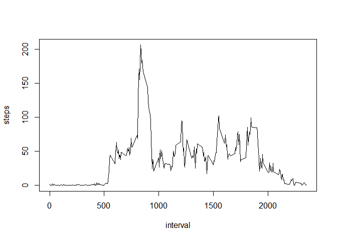

#Reproducible Research: Peer Assessment 1
####John Allen
####9/16/2015 
##### md

#DATA 

###Dataset: Activity monitoring data [52K], Activity.csv

###The variables included in this dataset are:
*  steps: Number of steps in a 5-minute interval (missing values are coded as NA)
*  date: The date on which the measurement was taken in YYYY-MM-DD format
*  interval: Identifier for the 5-minute interval in which measurement was taken
  
###Load the Libraries


```r
#install.packages("Hmisc")
library(Hmisc)   # impute function
```

```
## Warning: package 'Hmisc' was built under R version 3.2.2
```

```
## Loading required package: grid
## Loading required package: lattice
## Loading required package: survival
## Loading required package: Formula
```

```
## Warning: package 'Formula' was built under R version 3.2.2
```

```
## Loading required package: ggplot2
```

```
## Warning: package 'ggplot2' was built under R version 3.2.2
```

```
## 
## Attaching package: 'Hmisc'
## 
## The following objects are masked from 'package:base':
## 
##     format.pval, round.POSIXt, trunc.POSIXt, units
```

```r
library(ggplot2) #  use ggplot2 for plotting figures

activity <- read.csv("C:/Users/mom/Documents/activity.csv", colClass=c('integer', 'Date', 'integer'))
head(activity)
```

```
##   steps       date interval
## 1    NA 2012-10-01        0
## 2    NA 2012-10-01        5
## 3    NA 2012-10-01       10
## 4    NA 2012-10-01       15
## 5    NA 2012-10-01       20
## 6    NA 2012-10-01       25
```

##What is the mean total of steps taken per day?
(ignored the missing "NA"" values)


```r
steps_per_day <- aggregate(steps ~ date, activity, sum)
```
##Make a histogram of the total number of steps taken each day


```r
ggplot(steps_per_day, aes(x = steps)) + 
  geom_histogram(fill = "blue", binwidth = 500) + 
  labs(title="Steps Taken per Day", 
       x = "Number of Steps per Day", y = "Frequency ") + theme_bw() 
```

 

##Report the mean and median of the total number of steps taken per day


```r
mean(steps_per_day$steps)
```

```
## [1] 10766.19
```

```r
median(steps_per_day$steps)
```

```
## [1] 10765
```

##What is the average daily activity pattern?

###1. Make a time series plot (i.e. type = "l") of the 5-minute interval (x-axis) and the average number of steps taken, averaged across all days (y-axis)

```r
steps_interval <- aggregate(steps ~ interval, activity, mean)  
plot(steps_interval, type='l')
```

 
  
###2. Which 5-minute interval, on average across all the days in the dataset, contains the maximum number of steps?

```r
steps_interval$interval[which.max(steps_interval$steps)]
```

```
## [1] 835
```
##Imputing missing values

####Note that there are a number of days/intervals where there are missing values (coded as NA). The presence of missing days may introduce bias into some calculations or summaries of the data.

###Calculate and report the total number of missing values in the dataset (i.e. the total number of rows with NAs)

```r
missing_values <- sum(is.na(activity$steps))
missing_values
```

```
## [1] 2304
```

##Fill missing values with mean. 

###Create a new dataset  that is equal to the original dataset but with the missing data filled in.

```r
activity_impute <- activity
activity_impute$steps <- impute(activity$steps, fun=mean) 
```

###Check to see if any NA remain

```r
sum(is.na(activity_impute$steps))
```

```
## [1] 0
```

##Make a histogram of the total number of steps taken each day 

```r
steps_per_day_impute <- aggregate(steps ~ date, activity_impute, sum)
# Histogram steps per day
ggplot(steps_per_day_impute, aes(x = steps)) + 
  geom_histogram(fill = "orange", binwidth = 500) + 
  labs(title="Steps Taken per Day", 
       x = "Number of Steps per Day", y = "Frequency ") + theme_bw() 
```

 

##Calculate and report the mean and median total number of steps taken per day. 
####Steps per day:

```r
# original steps per day
sum(steps_per_day$steps)
```

```
## [1] 570608
```
####Mean: 

```r
# mean steps per day
mean(steps_per_day_impute$steps)
```

```
## [1] 10766.19
```
####Median:

```r
# median steps per day
median(steps_per_day_impute$steps)
```

```
## [1] 10766.19
```

##The  from the estimates from the first part of the assignment? What is the impact of imputing missing data on the estimates of the total daily number of steps?
  
  The mean remained 10766.19 for both datasets.
  The median changed from  10765 to 10766.19.
  The steps per day on the data "with NA"" was 570608,
  and it increased on the "imputed data""  to  656737.5
  
  
  
##Are there differences in activity patterns between weekdays and weekends?  

- The weekdays had a higher max but after the spike varried less than on the    weekend.   

##Make a panel plot containing a time series.


```r
activity_impute$dateType <- ifelse(as.POSIXlt(activity_impute$date)$wday %in% c(0,6), 'weekend', 'weekday')
dayavg_activity_impute <- aggregate(steps ~ interval + dateType, data=activity_impute,mean)
# make apanel plot containg a time series
ggplot (dayavg_activity_impute, aes(interval,steps)) +
        geom_line() +
        facet_grid(dateType ~ .) +
        xlab("5 min interval") +
        ylab("avg num steps")
```

 
  
  

